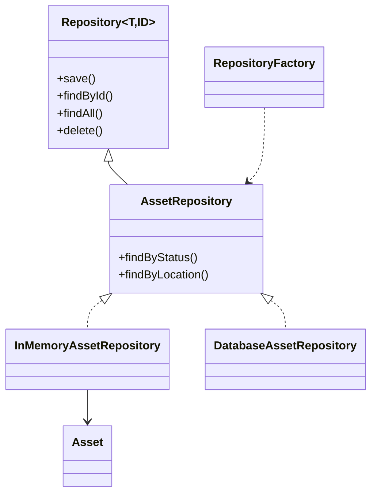

# Repository Layer Class Diagram

```mermaid
classDiagram

class Repository~T,ID~{
+save()
+findById()
+findAll()
+delete()
}

class AssetRepository{
+findByStatus()
+findByLocation()
}

class InMemoryAssetRepository
class DatabaseAssetRepository
class RepositoryFactory
class Asset

Repository <|-- AssetRepository
AssetRepository <|.. InMemoryAssetRepository
AssetRepository <|.. DatabaseAssetRepository

RepositoryFactory ..> AssetRepository
InMemoryAssetRepository --> Asset
```
