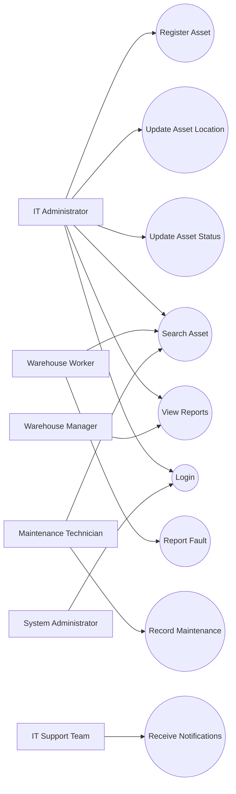

# Use Case Diagram
Warehouse IT Asset Tracking System

```mermaid
flowchart LR

Admin[IT Administrator]
Worker[Warehouse Worker]
Manager[Warehouse Manager]
Tech[Maintenance Technician]
Support[IT Support Team]
SysAdmin[System Administrator]

UC1((Register Asset))
UC2((Update Asset Location))
UC3((Update Asset Status))
UC4((Search Asset))
UC5((Record Maintenance))
UC6((View Reports))
UC7((Report Fault))
UC8((Receive Notifications))
UC9((Login))

Admin --> UC1
Admin --> UC2
Admin --> UC3
Admin --> UC4
Admin --> UC6
Admin --> UC9

Worker --> UC7
Worker --> UC4

Manager --> UC6

Tech --> UC5
Tech --> UC4

Support --> UC8

SysAdmin --> UC9
```
