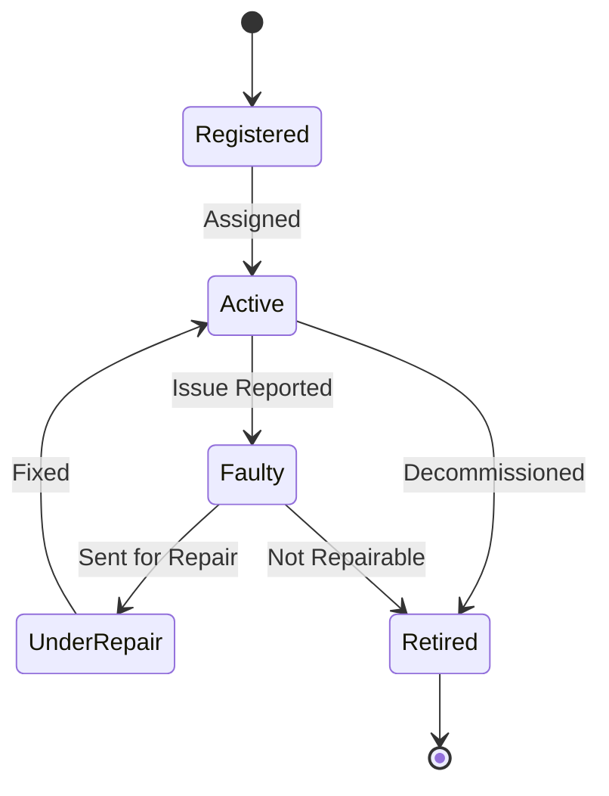

# Object State Modeling

## Asset State Transition Diagram

```mermaid
stateDiagram-v2
[*] --> Registered

Registered --> Active : Assigned
Active --> Faulty : Issue Reported
Faulty --> UnderRepair : Sent for Repair
UnderRepair --> Active : Fixed
Active --> Retired : Decommissioned
Faulty --> Retired : Not Repairable
Retired --> [*]
```
