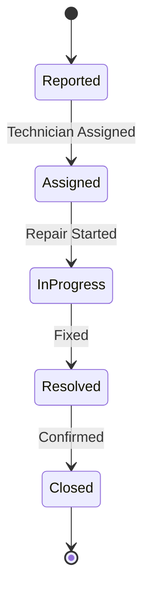

## Fault Report State Diagram

```mermaid
stateDiagram-v2
[*] --> Reported

Reported --> Assigned : Technician Assigned
Assigned --> InProgress : Repair Started
InProgress --> Resolved : Fixed
Resolved --> Closed : Confirmed
Closed --> [*]
```
