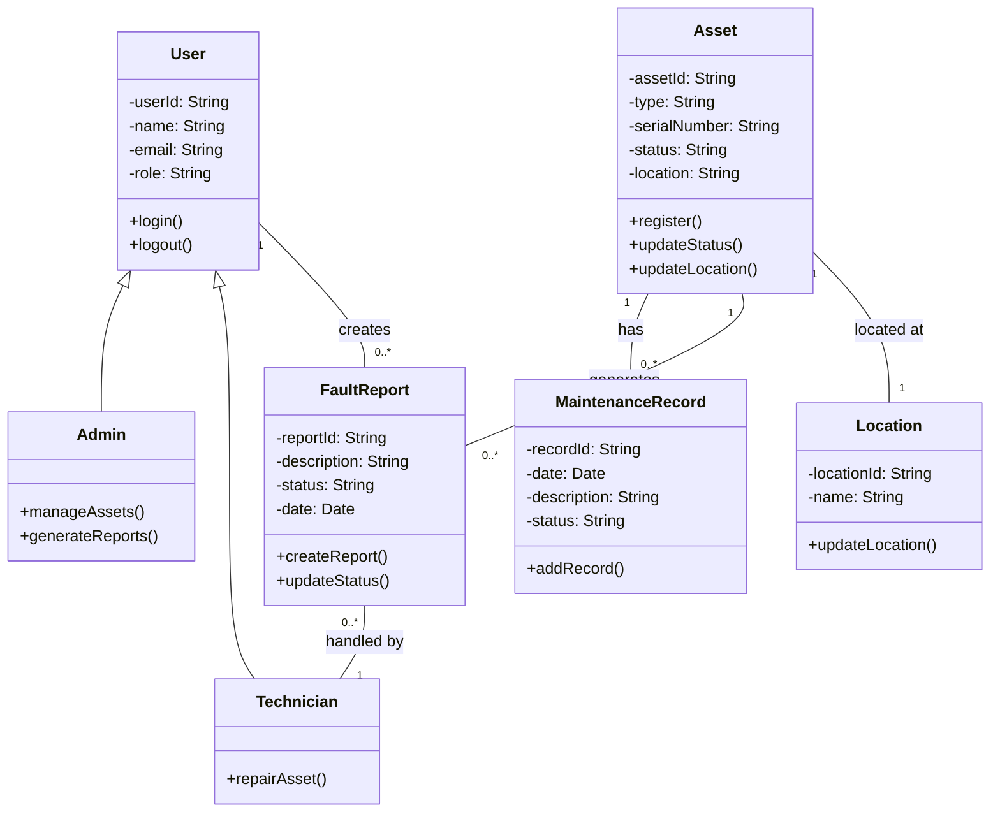

# Class Diagram
Warehouse IT Asset Tracking System

## Design Decisions

- Inheritance is used where Admin and Technician extend User.
- Composition is shown between Asset and MaintenanceRecord.
- Associations represent interactions between entities.

### Alignment

This diagram aligns with:
- FR1 (Asset Registration)
- FR5 (Maintenance Tracking)
- FR8 (Fault Reporting)
- Use Cases (Assignment 5)
- State Diagrams (Assignment 8)

### Key Design Choices

- Simplified class structure to maintain clarity.
- Focus on core system functionality.
- Avoided over-complication while maintaining completeness.

