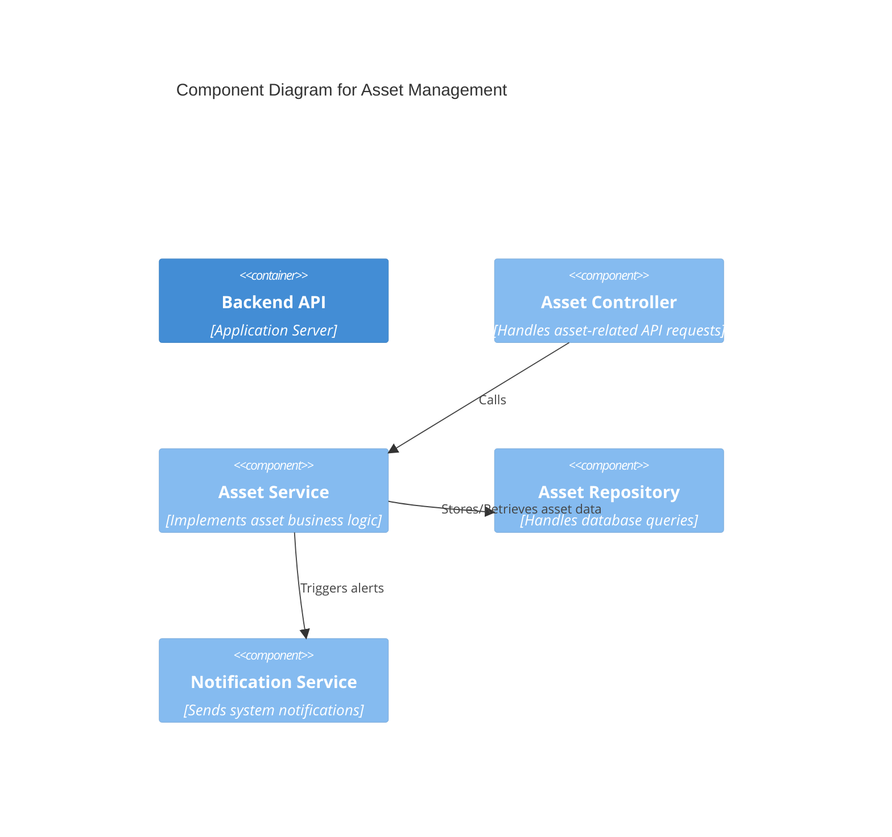

```mermaid
C4Component
title Component Diagram for Asset Management

Container(api, "Backend API", "Application Server")

Component(assetController, "Asset Controller", "Handles asset-related API requests")

Component(assetService, "Asset Service", "Implements asset business logic")

Component(assetRepository, "Asset Repository", "Handles database queries")

Component(notificationService, "Notification Service", "Sends system notifications")

Rel(assetController, assetService, "Calls")

Rel(assetService, assetRepository, "Stores/Retrieves asset data")

Rel(assetService, notificationService, "Triggers alerts")
```
