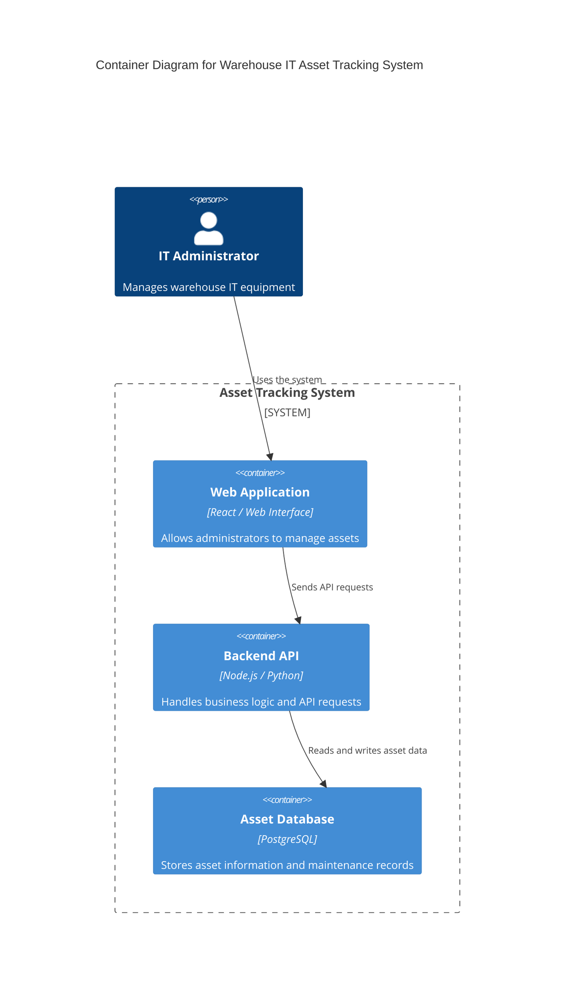

```mermaid
C4Container
title Container Diagram for Warehouse IT Asset Tracking System

Person(admin, "IT Administrator", "Manages warehouse IT equipment")

System_Boundary(system, "Asset Tracking System") {

Container(webApp, "Web Application", "React / Web Interface", "Allows administrators to manage assets")

Container(api, "Backend API", "Node.js / Python", "Handles business logic and API requests")

Container(database, "Asset Database", "PostgreSQL", "Stores asset information and maintenance records")

}

Rel(admin, webApp, "Uses the system")

Rel(webApp, api, "Sends API requests")

Rel(api, database, "Reads and writes asset data")
```
